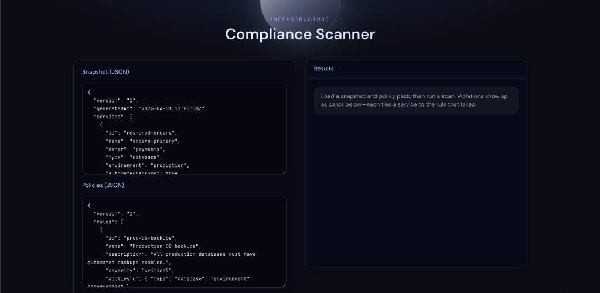
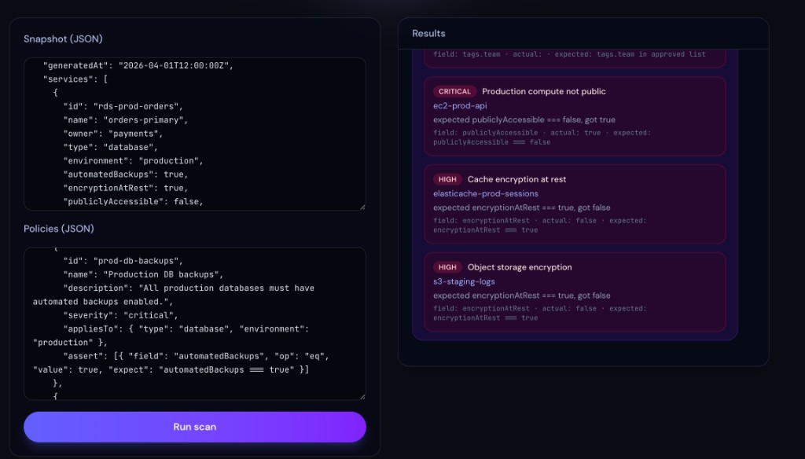

# Infrastructure compliance scanner

Description:

The product is a policy evaluation service for infrastructure-shaped data. It loads a normalized service snapshot (JSON: a list of resources with type, environment, and attributes such as backup, encryption, and instance class) and a compliance rule bundle (JSON: selectors plus field assertions). A shared rule engine evaluates every applicable rule against every matching service and returns a structured violation list (rule identity, service identity, severity, human-readable reason, and field-level actual vs expected). The web layer exposes that engine through an interactive editor and scan flow; the API and CLI invoke the same evaluation logic so results stay consistent across entry points. Sample inputs and a frozen example scan output live under `examples/`.

Technologies:

- TypeScript
- Node.js
- Next.js (App Router, React)
- Tailwind CSS
- Docker
- Docker Compose
- Kubernetes (example manifests)
- Helm (example chart)
- JSON (snapshot and policy file formats)
- Render (`render.yaml` blueprint for a hosted web service so you are not tied to localhost)

Screenshots:

Future ideas (not implemented yet):

- Terraform / other IaC as an input source (convert plan JSON into the same snapshot format so rules can run pre-deploy in CI)
