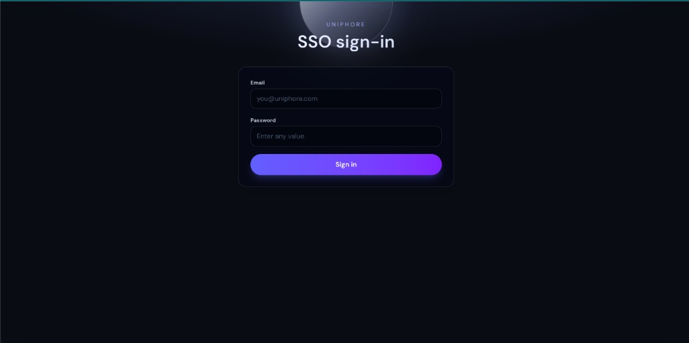
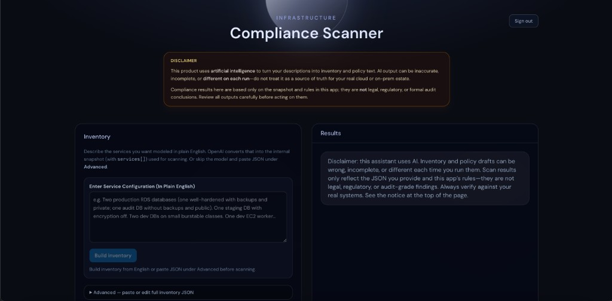
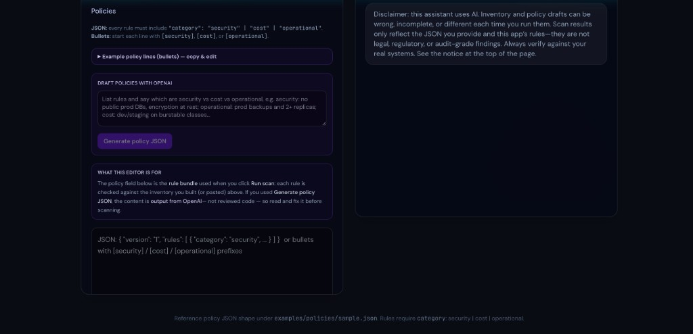

# Infrastructure compliance scanner

Web app and shared TypeScript engine that evaluates **policies** against a normalized **infrastructure snapshot** (a JSON `services[]` list with fields such as environment, backups, encryption, public access, replicas, and instance types).

## How the UI works

1. **Sign in** — The app opens on a **Uniphore SSO** demo login. Use an **`@uniphore.com`** email and a non-empty password (demo only; not verified against any directory). Then you reach the scanner.
2. **Inventory** — In **Enter Service Configuration (In Plain English)**, describe the services you want (environments, databases, compute, posture). **Build inventory** calls OpenAI (`OPENAI_API_KEY` on the server) to produce the internal snapshot. Alternatively, open **Advanced** and paste or edit full inventory JSON (`version` + `services`).
3. **Policies** — Enter rules as JSON (each rule must include `category`: `security`, `cost`, or `operational`) or as bullet lines prefixed with `[security]`, `[cost]`, or `[operational]`. You can **Draft policies with OpenAI** from plain English.
4. **Run scan** — The rule engine runs in-process; results are deterministic.
5. **After a successful scan** — The results panel shows **Sent to Service Manager** and a **Download PDF of compliance results** button (browser download via `jspdf`). Violations still show severity; **passed checks** are labeled **pass** only (no severity chip in the UI).

## Stack

TypeScript, Node.js 20+, Next.js (App Router), React, Tailwind CSS, **jspdf** (PDF export). Docker / Compose, and example Kubernetes / Helm manifests are included for deployment patterns.

For a file-by-file map (OpenAI, Docker, K8s, future ideas), see **[docs/TECH_STACK.md](docs/TECH_STACK.md)**.

For stakeholders: solution intent, Git for policies, data/privacy, and how AI vs rule engine fit, see **[docs/SOLUTION_OVERVIEW.md](docs/SOLUTION_OVERVIEW.md)**.

## Screenshots

Uniphore SSO sign-in (demo gate before the app):

Main scanner — inventory, disclaimer, and results panel:

Policies — rules, OpenAI draft, and policy bundle editor:

## Future ideas

- Terraform / other IaC importers that emit the same snapshot JSON for pre-deploy checks in CI.
